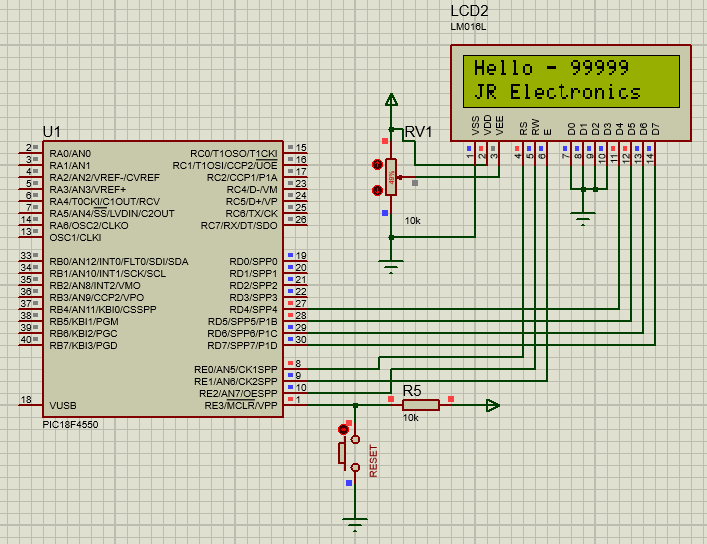
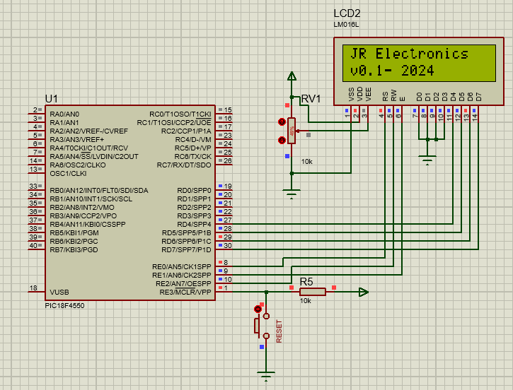
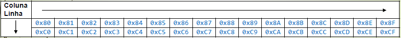
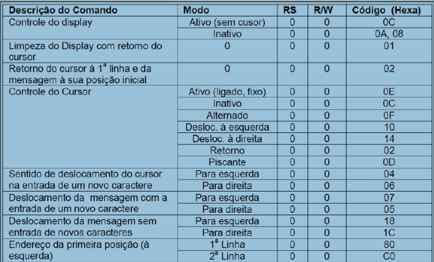

# Introdução
A criação de sistemas embarcados e de hardware que utilizam displays para montar interfaces
IHM (homem-máquina) vem crescendo cada vez mais. Portanto, a utilização e manipulação
de uma biblioteca eficiente é de suma importância, especialmente se for de fácil compreensão e
uso para o desenvolvedor. A biblioteca implementada a seguir garante esses requisitos. Ela foi
desenvolvida para manipular um display 16x2 no modo de 4 bits, com caracteres no formato
5x8 pontos.

## Funções
Para a manipulação do display foram implementadas as seguintes funções:
* `disp_Init():` Responsável por inicializar o display.
* `disp Clear():` Responsável por limpar o display.
* `disp Putc(unsigned char chr):` Responsável por enviar um caractere ao display.
* `disp Puts(char *buffer):` Responsável por escrever uma string no display.
* `disp WriteCmd(unsigned char cmd):` Responsável por escrever uma string no display.
* `send number(unsigned num):` Responsável por escrever um número inteiro de até 5
dígitos no display.
* `__Delay():` Gera o delay em milisegundos.
* `__DelayUs():` Gera o delay em microsegundos.

Exemplo de aplicação das funções implementadas utilizando o MCU PIC18F4550, compilador
MPLAB X e XC8 (v1.45).

```c
//--- Libraries ---
#include <xc.h>
#include "lcd_jr.h"

//==============================================================================
//--- Definicao de diretivas ---
#pragma config PLLDIV = 5         // PLL para 20MHz
#pragma config CPUDIV = OSC1_PLL2 // PLL desligado
#pragma config FOSC = HS          // Fosc = 20MHz; Tcy = 200ns
#pragma config WDT = OFF          // Watchdog timer desativado
#pragma config PBADEN = OFF       // Pinos do PORTB come�am como digitais
#pragma config LVP = OFF          // Desabilita gravacao em baixa tensao
#pragma config DEBUG = ON         // Habilita debug
#pragma config MCLRE = ON         // Habilita MCLR e desabilita RE3 como I/O
#define _XTAL_FREQ 20000000       


//==============================================================================
//--- Main Function ---
void main(void) 
{
    TRISD = 0x00;              // Configura o PORTD como sa�da
    TRISE = 0x00;              // Configura o PORTE como sa�da
    LATD  = 0;                 // Garante que os pinos do PORTD estao em 0V
    
    disp_Init();               // Inicializa o display     
    disp_WriteCmd(0x0C);       // Desliga o cursor e o blink
    
    while(1)
    {
        disp_Clear();                // Limpa o display
        disp_WriteCmd(0x80);         // Mover para o in�cio da primeira linha
        disp_Putc('H');              // Escreve "HELLO" enviando caracteres
        disp_Putc('l');
        disp_Putc('l');
        disp_Putc('o');
        disp_Putc(' ');
        disp_Putc('-');
        disp_Putc(' ');
        send_number(99999);           // Envia um numero inteiro de 5 digitos
        disp_WriteCmd(0xC0);          // Mover para o in�cio da segunda linha
        disp_Puts("JR Electronics");  // Escrever "teste"
        __Delay(1500);
        disp_Clear();
        disp_WriteCmd(0x80);          
        disp_Puts("JR Electronics");  // Escrever "teste"
        disp_WriteCmd(0xC0);
        disp_Puts("v0.1-");
        send_number(2024);
        __Delay(1500);
    }
}//end main function

//=======================================================================================================
//--- End of Program ---

```
Resultado da utilização das funções implementadas, utilizando o software Proteus 8 para
simulação:

<p align="center">
  
  
</p>

<p align="center">
  <b>(a)</b> Primeira parte do código. &nbsp;&nbsp;&nbsp; <b>(b)</b> Segunda parte do código.
</p>

As imagens abaixo mostram as posições que os caracteres podem assumir no LCD e os
comandos que podem ser enviados ao display:

### Posição dos Caracteres


### Comandos que podem ser enviados ao lcd

